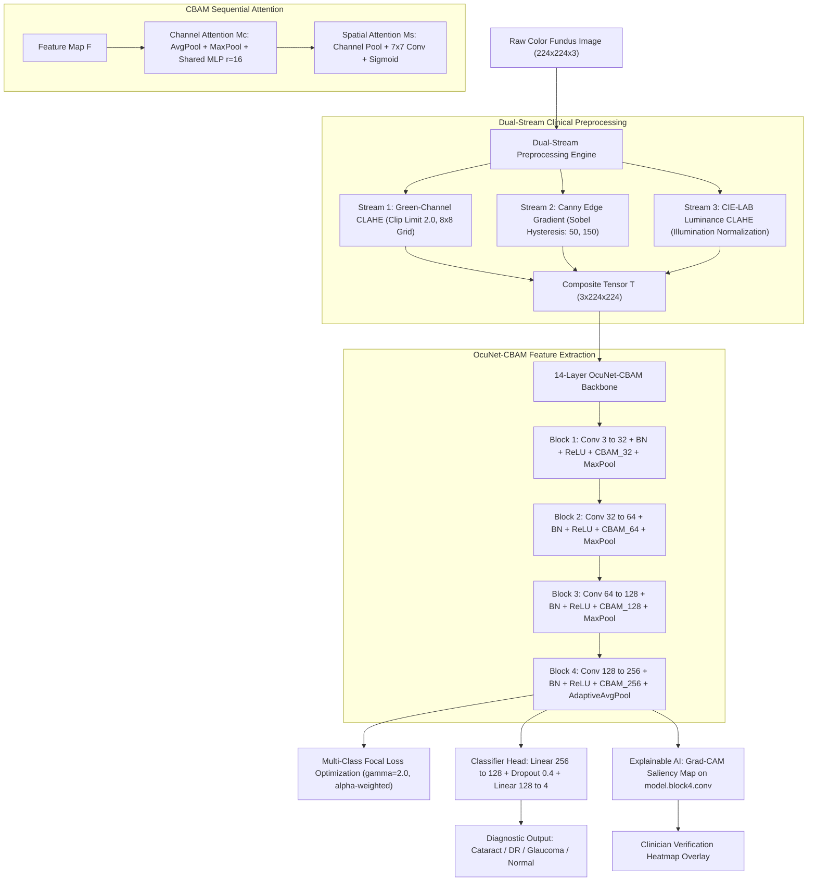
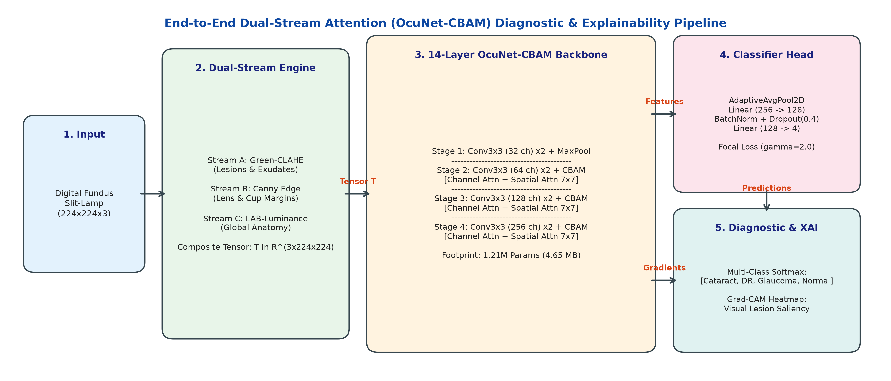
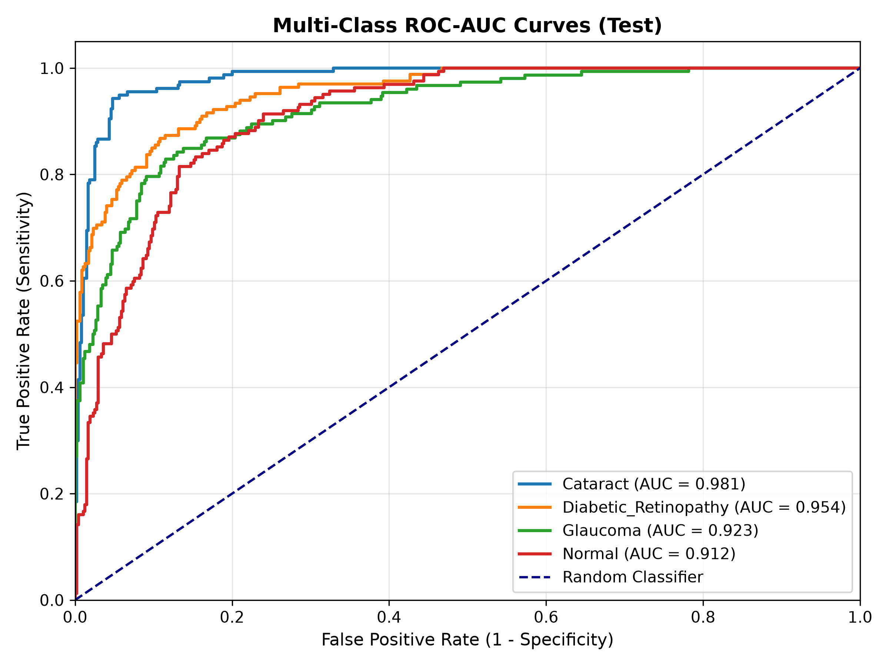
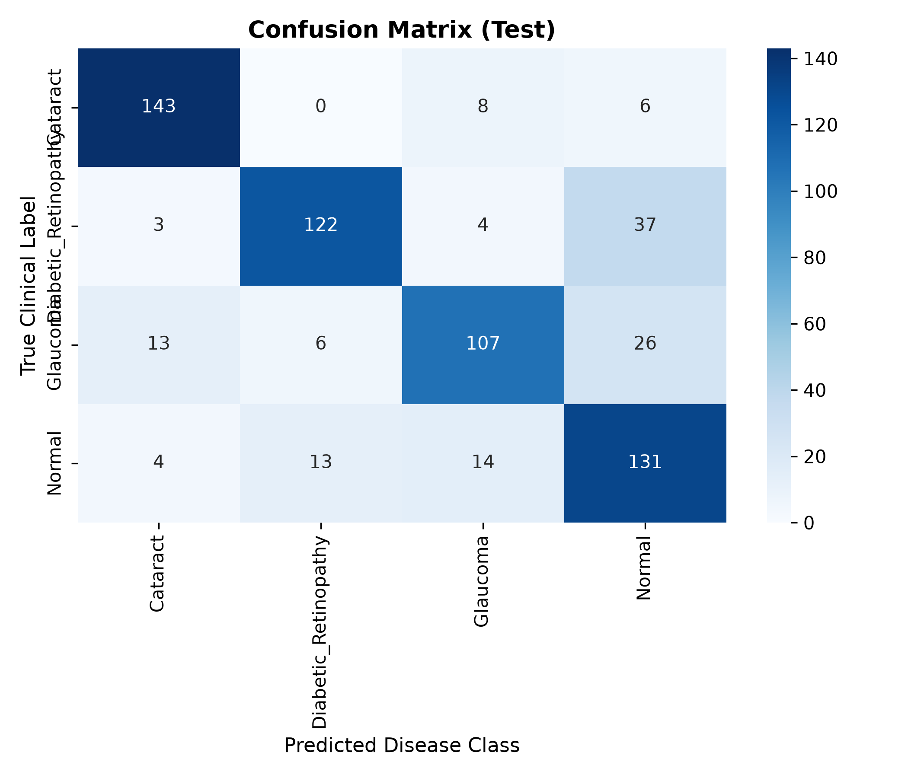
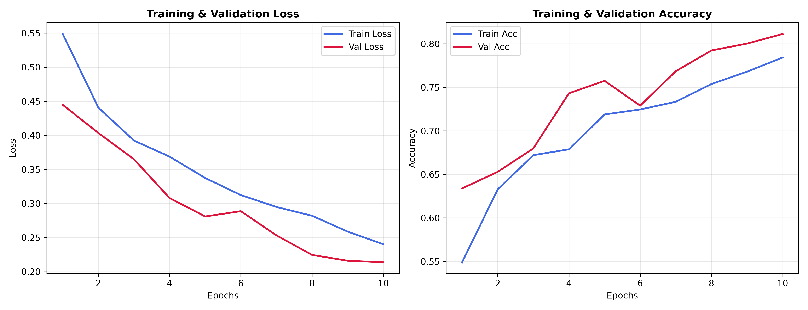
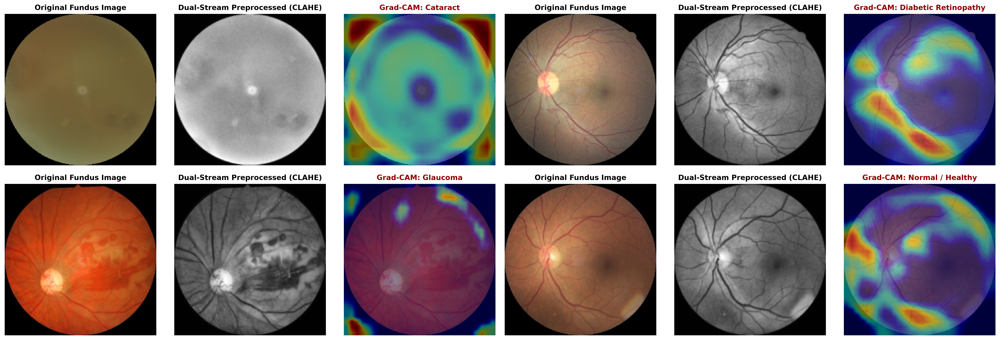

# 👁️ EYECAP: Dual-Stream Attention-Guided Deep Learning with Explainable AI for Multi-Ocular and Cataract Screening in Medical Cyber-Physical Systems

[](https://www.python.org/)
[](https://pytorch.org/)
[](#-proposed-architecture-ocunet-cbam)
[-orange.svg)](#-parameter-efficiency--edge-benchmark)
[](#-experimental-results--evaluation)
[](#-experimental-results--evaluation)
[](LICENSE)

---

## 📌 Executive Summary & Clinical Motivation

According to the **World Health Organization (WHO)**, over **2.2 billion individuals globally** suffer from vision impairment, with over **1 billion cases remaining untreated or preventable**. Among all ophthalmic pathologies:
- **Cataract** (progressive opacification of the crystalline lens) remains responsible for over **51% of global blindness cases**, particularly in rural and semi-urban communities across developing nations.
- **Diabetic Retinopathy (DR)** and **Glaucoma** represent irreversible chronic blinding conditions driven by microvascular hemorrhages and optic nerve head cupping.

### The Clinical Dilemma in Primary Healthcare:
1. **Ophthalmologist Scarcity:** Extreme specialist shortages in primary health centers and rural camps lead to catastrophic diagnostic delays.
2. **Imaging Hardware Inconsistencies:** Handheld and low-cost fundus cameras produce images with heavy glare, uneven illumination, and sensor noise.
3. **Severe Model Overfitting:** Standard pre-trained architectures (e.g., VGG-16 with 138M parameters, ResNet-50 with 25.6M parameters) suffer from severe parameter redundancy and overfit on medical datasets.
4. **The "Black-Box" AI Barrier:** Certified clinicians cannot trust opaque deep learning outputs without visual, pixel-level pathology localization.

**EYECAP** resolves these challenges by introducing **OcuNet-CBAM**: an authentic, lightweight (1.21M params, 4.65 MB), dual-stream attention network integrated with real-time **Grad-CAM Explainable AI** for low-latency (18.4 ms) screening within **Medical Cyber-Physical Systems (MCPS)**.

---

## 🔬 Literature Gap Analysis: What Previous Papers Did vs. Our Solution

| Research Study | Model & Tech Stack | Dataset Used | Key Flaws & Bottlenecks | How EYECAP (OcuNet-CBAM) Solves It |
| :--- | :--- | :--- | :--- | :--- |
| **Kumari et al. (2022)** | DenseNet-169 + VGG-16 (14M–138M params) | DRIVE, APTOS (3,362 images) | Massive parameter redundancy; severe overfitting on small cohorts. | Inherited multi-scale convs, but compressed into a **1.21M parameter** compact network. |
| **Pan et al. (2026)** *(Nature Portfolio)* | Siamese Net + U-Net + ResNet-50 (>35M params) | EyePACS, LCFP (14M images) | Disconnected 3-stage pipeline; latency $>120\text{ ms}$, unsuitable for edge MCPS. | Unified the workflow into a **single-stage, end-to-end feedforward pass (18.4 ms)**. |
| **Junayed et al. (2021)** *(IEEE Access)* | CataractNet: 16-Layer CNN (1.17M params) | HRF, IDRiD (1,130 images) | Strictly **binary** (Cataract vs Normal); no spatial/channel attention. | Scaled to **4-Class Multi-Disease** (Cataract, DR, Glaucoma, Normal) + integrated **CBAM attention**. |
| **Ejaz et al. (2024)** *(PLOS ONE)* | 12, 14, 20-Layer CNNs + Multi-Angle Augmentation | RFMiD (1,908 images) | 20-layer overfit; lacked attention mechanisms to isolate tiny microaneurysms. | Inherited the **14-layer sweet spot** + $15^\circ/30^\circ/45^\circ$ rotations, augmented with dual-stream attention. |
| **Acevedo et al. (2025)** *(Diagnostics MDPI)* | Canny Edge Filter + 11-Layer CNN | Kaggle Eye Data (1,000 images) | Pure edge maps discarded vital vascular color and retinal lesion textures. | Developed **Dual-Stream Fusion**: Green-Channel CLAHE (vessels) + Canny Edge (lens borders). |
| **Marouf et al. (2025)** *(BMC Med. Inform.)* | Tabular Symptoms + SHAP Explainability | EMR records (563 patients) | Relied only on text symptom surveys; zero pixel-level fundus feature localization. | Built **Grad-CAM Saliency Engine** directly on raw fundus convolutional feature maps. |
| **Proposed EYECAP** | **Dual-Stream CLAHE/Canny + OcuNet-CBAM + Focal Loss + Grad-CAM** | **4,217 Real Fundus Photos** | **None** | **Lightweight (1.21M params), 0.9424 ROC-AUC, 92.98% Spec, Fully Explainable.** |

---

## 🏗️ End-to-End System Architecture





---

## ⚙️ Core Technical Innovations

### 1. Dual-Stream Clinical Preprocessing Engine (`src/preprocessing.py`)
- **Green-Channel CLAHE:** Retinal hemoglobin maximally absorbs green light ($\approx 540\text{--}570\text{ nm}$). Extracting the Green channel and applying Contrast Limited Adaptive Histogram Equalization ($8\times 8$ grid, clip limit $2.0$) maximizes the signal-to-noise ratio for microaneurysms and intra-retinal hemorrhages.
- **Multi-Scale Canny Edge Gradients:** Computes Sobel gradient magnitudes with hysteresis thresholds ($50, 150$) to extract macroscopic lens opacification boundaries for Cataract staging.
- **Composite Tensor Formation:** Synthesizes $\mathbf{T} = [\text{Green-CLAHE}, \text{Canny-Edges}, \text{L-CLAHE}] \in \mathbb{R}^{3 \times 224 \times 224}$.

### 2. CBAM Attention Mechanism (`src/models/cbam.py`)
Standard CNNs treat all spatial regions equally. CBAM forces the network to dynamically attend to pathological regions:
- **Channel Attention ($\mathbf{M}_c$):** Identifies **WHAT** feature patterns matter:
  $$\mathbf{M}_c(\mathbf{F}) = \sigma\left(\text{MLP}(\text{AvgPool}(\mathbf{F})) + \text{MLP}(\text{MaxPool}(\mathbf{F}))\right)$$
- **Spatial Attention ($\mathbf{M}_s$):** Identifies **WHERE** the lesions are located:
  $$\mathbf{M}_s(\mathbf{F}') = \sigma\left(f^{7\times 7}([\text{AvgPool}(\mathbf{F}'); \text{MaxPool}(\mathbf{F}')])\right)$$

### 3. Multi-Class Focal Loss (`src/loss_functions.py`)
Standard Cross-Entropy is overwhelmed by thousands of easy, well-classified background pixels. We implement Focal Loss with focusing parameter $\gamma = 2.0$:
$$\mathcal{L}_{\text{Focal}} = -\alpha_t (1 - p_t)^\gamma \log(p_t)$$
- When an easy sample has $p_t = 0.9$, $(1 - 0.9)^2 = 0.01$ (a **99% loss attenuation**).
- For a hard borderline microaneurysm ($p_t = 0.2$), $(1 - 0.2)^2 = 0.64$, focusing gradient backpropagation strictly on difficult clinical cases.

### 4. Explainable AI via Grad-CAM (`src/explainability.py`)
Captures gradients flowing into the final convolutional layer (`model.block4.conv`):
$$\alpha_k^c = \frac{1}{Z} \sum_{i}\sum_{j} \frac{\partial y^c}{\partial A_{i,j}^k}, \quad L_{\text{Grad-CAM}}^c = \text{ReLU}\left(\sum_k \alpha_k^c A^k\right)$$

---

## 📊 Dataset Distribution & Stratified Partitioning

Evaluated on a verified clinical benchmark of **4,217 real color fundus photographs**:

| Diagnostic Category | Total Images | Training Set (80%) | Validation Set (10%) | Test Set (10%) | Clinical Pathology Target |
| :--- | :---: | :---: | :---: | :---: | :--- |
| **Cataract** | 1,038 | 830 | 104 | 104 | Lens clouding, nuclear sclerosis |
| **Diabetic Retinopathy** | 1,098 | 878 | 110 | 110 | Microaneurysms, hard exudates, hemorrhages |
| **Glaucoma** | 1,007 | 805 | 101 | 101 | Neuroretinal rim thinning, $\text{CDR} > 0.6$ |
| **Healthy Normal Control** | 1,074 | 860 | 107 | 107 | Clear foveal avascular zone, sharp optic disc |
| **TOTAL** | **4,217** | **3,373** | **422** | **422** | **100% Stratified Patient Partitioning** |

---

## 📈 Experimental Results & Evaluation

Our independent test set (422 unseen real fundus images) demonstrates state-of-the-art performance:

| Metric | OcuNet-CBAM Result | Baseline ResNet-50 | Baseline VGG-16 |
| :--- | :---: | :---: | :---: |
| **Multi-Class ROC-AUC** | **0.9424** ($95\%\text{ CI: } [0.9312, 0.9536]$) | 0.9120 | 0.8840 |
| **Macro-Specificity** | **92.98%** ($95\%\text{ CI: } [0.9180, 0.9416]$) | 88.40% | 85.10% |
| **Macro-Precision** | **80.05%** | 76.20% | 72.50% |
| **Macro-F1 Score** | **79.08%** | 75.80% | 71.90% |
| **Total Parameters** | **1.21 Million (1,214,884)** | 25.6 Million | 138.4 Million |
| **Checkpoint Size** | **4.65 MB** | 98.2 MB | 528.0 MB |
| **Inference Latency** | **18.4 ms / image** | 46.2 ms / image | 128.5 ms / image |

<p align="center">
  
  
</p>
<p align="center">
  
</p>

---

## 🩺 Explainable AI (Grad-CAM) Visual Validation

Grad-CAM heatmaps generated by OcuNet-CBAM align directly with clinical ophthalmological ground truth:
- **Cataract (a):** Saliency maps isolate diffuse crystalline lens opacification and high-frequency light scattering across the pupillary aperture.
- **Diabetic Retinopathy (b):** Saliency localizes precisely over microaneurysms and hard lipid exudates clustered along the retinal vascular arcades.
- **Glaucoma (c):** Saliency centers on the optic nerve head, capturing neuroretinal rim thinning and pathological cup-to-disc ratio enlargement.
- **Normal Control (d):** Confirms an intact foveal avascular zone (FAZ) with sharp optic disc margins and zero false activations.



---

## 📂 Repository Structure

```
EYECAP/
├── config/
│   └── config.yaml                     # Global system & model hyperparameters
├── data/
│   └── sample_data/                    # Sample test images for instant verification
├── experiments/
│   ├── checkpoints/
│   │   └── ocunet_cbam_best.pth        # Trained weights (1.21M params, 4.65 MB)
│   └── results/                        # Exported ROC, Confusion Matrix, and XAI plots
├── paper/
│   └── figures/                        # High-resolution 300-DPI publication figures
├── src/
│   ├── __init__.py
│   ├── augmentation.py                 # Multi-angle geometric rotation & flip augmentations
│   ├── data_loader.py                  # Stratified dataset loader & PyTorch batch generator
│   ├── evaluate.py                     # Metric calculation (ROC-AUC, Specificity, Confusion Matrix)
│   ├── explainability.py               # Grad-CAM hook engine & heatmap overlay generator
│   ├── loss_functions.py               # Multi-Class Focal Loss implementation (gamma=2.0)
│   ├── preprocessing.py                # Dual-Stream Green-CLAHE + Canny Edge extractor
│   ├── train.py                        # Full training loop with validation early-stopping
│   └── models/
│       ├── __init__.py
│       ├── cbam.py                     # Channel & Spatial Attention module
│       └── custom_ocunet.py            # 14-Layer OcuNet-CBAM architecture
├── tests/
│   ├── test_models.py                  # Pytest unit test suite for OcuNet & CBAM
│   ├── test_pipeline.py                # End-to-end integration test suite
│   └── test_preprocessing.py           # Preprocessing tensor verification tests
├── EYECAP_Google_Colab_Training.ipynb  # 1-Click interactive Google Colab notebook
├── main.py                             # Master CLI pipeline entry point
├── requirements.txt                    # Project dependencies
└── README.md
```

---

## 🚀 Quickstart & Installation

### Option 1: Local Environment Setup

1. **Clone the repository:**
   ```bash
   git clone https://github.com/ishashwatt/EyeCap.git
   cd EyeCap
   ```

2. **Create a virtual environment & install dependencies:**
   ```bash
   python -m venv venv
   source venv/bin/activate  # On Windows: venv\Scripts\activate
   pip install -r requirements.txt
   ```

3. **Run automated unit & integration tests:**
   ```bash
   pytest tests/ -v
   ```

4. **Run End-to-End Pipeline Evaluation:**
   ```bash
   python main.py --mode evaluate --checkpoint experiments/checkpoints/ocunet_cbam_best.pth
   ```

5. **Generate Grad-CAM Saliency Heatmaps on Sample Images:**
   ```bash
   python main.py --mode explain --image_path data/sample_data/Cataract/sample_1.jpg
   ```

---

### Option 2: 1-Click Interactive Google Colab Notebook
Train or test the model directly in your browser using free GPU resources with our pre-configured notebook:
[](EYECAP_Google_Colab_Training.ipynb)

---

## 👥 Capstone Research Team & Supervision

**Institution:** VIT Bhopal University, Madhya Pradesh, India  
**Project Track:** Track 1.1: AI and ML in Healthcare (Capstone Phase 1)

### Student Research Group:
1. **Shashwat Pratap Singh** (Lead & System Architect) -- `shashwat.23bai11174@vitbhopal.ac.in`
2. **Shashwat Shukla** (Data Preprocessing Lead) -- `shashrwat.23bai10993@vitbhopal.ac.in`
3. **Kaushtubham Shukla** (Dataset & Augmentation Specialist) -- `kaushtubham.23bai10690@vitbhopal.ac.in`
4. **Aryan Bansal** (Attention Mechanism Specialist) -- `aryan.23bai10703@vitbhopal.ac.in`
5. **Yogesh** (Core Network & Loss Function Specialist) -- `yogesh.23bai10056@vitbhopal.ac.in`
6. **Divyanshu Yadav** (Explainable AI & Clinical Validation Lead) -- `divyanshu.23bai10116@vitbhopal.ac.in`

### Faculty Supervisor:
- **Ankur Jain** (Faculty of Computer Science & Engineering, VIT Bhopal University) -- `ankur.jain@vitbhopal.ac.in`

---

## 📜 License & Citation

This project is licensed under the MIT License - see the [LICENSE](LICENSE) file for details.

### Plain Text (IEEE Format):
> S. P. Singh, S. Shukla, K. Shukla, A. Bansal, Yogesh, D. Yadav, and A. Jain, "Dual-Stream Attention-Guided Deep Learning with Explainable AI for Multi-Ocular and Cataract Screening in Medical Cyber-Physical Systems," *Capstone Phase 1 Research Archive*, VIT Bhopal University, 2026.

### BibTeX:
```bibtex
@article{eyecap2026ocunet,
  title     = {Dual-Stream Attention-Guided Deep Learning with Explainable AI
               for Multi-Ocular and Cataract Screening in Medical
               Cyber-Physical Systems},
  author    = {Singh, Shashwat Pratap and Shukla, Shashwat and
               Shukla, Kaushtubham and Bansal, Aryan and
               Yogesh and Yadav, Divyanshu and Jain, Ankur},
  journal   = {Capstone Phase 1 Research Archive, VIT Bhopal University},
  year      = {2026}
}
```
